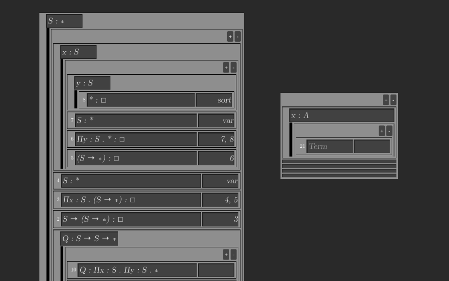

Lambda Helper
=============

This Godot project allows easy drag-and-drop construction of flag proofs as commonly used in the lambda calculus, e.g. in the textbook _Type Theory and Formal Proof_ by Nederpelt & Geuvers (https://doi.org/10.1017/CBO9781139567725.009)

To Run
------
Currently the project can only be run through Godot 4.4, eventually it might be exported to an executable. Get Godot [here](https://godotengine.org/) (it's free!)

About
-----
The motivation for this project is that writing flag proofs by hand with pen and paper is a very frustrating exercise as they must be written bottom-to-top, and the amount of space necessary for the proof needs to be anticipated in advance! This makes the pen user liable to a considerable amount of ink stains on their hands, a lot of wasted paper, and a lot of important steps crammed into margins.

Theoretically it can help writing flag proofs for natural deduction as well; any Gentzen-style deduction system has a corresponding flag proof method, particularly those which use contexts (flags), although systems without contexts might still find value in the drag-and-drop interface minus flags. 

If not obvious, this software is not a proof assistant or proof checker! It is purely an aid for writing out formal derivations. 
At least currently, nothing is validated. 

Todo
----

- Include references to rules of lambda-calculi inside the engine, similarly to the help window
- Allow saving proofs 
- Allow user-defined text substitution
- Use GraphNodes on terms to link premises with conclusions, and make this stable when terms are moved
- Highlight unlinked nodes; force user to select rule from a drop-down menu (var, abst, etc.) and highlight unjustified terms; change number of GraphNodes based on selected rule
- Bugs and responsiveness etc

